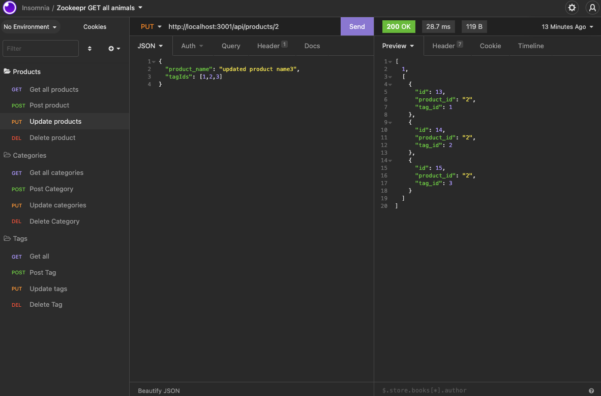

# E-commerce Back End 

This application allows users to manage the back-end of a company e-commerce site.

## Table of Contents
* Languages
* Link
* Preview
* Installation
* Usage
* License

## Languages
This project was built with JavaScript, Node, Express, and MySql

## Link
https://github.com/daniellefortin2021/ecommerce-site

## Preview

View preview: https://watch.screencastify.com/v/HiZVwj6WvkQPcULYwGLk 

## Installation
Install Node.JS on your computer by running npm install in the command line. Then, clone the repository to your computer.

## Usage
To start using the application, install MySql in your command line and then import the database with source db/schema.sql. Run the seeds using npm run seed. Then start the application with npm start. Once you've got the application running, you will be able to view all the get, post, put, and delete routes with Insomnia.

## License
This project is licensed under MIT.